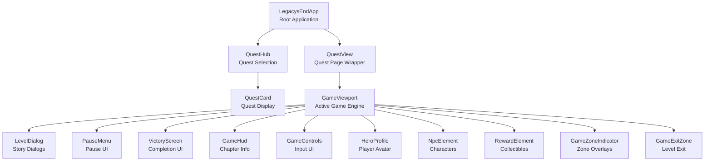

# Component Architecture & Context Strategy

## Component Hierarchy



## Service & Controller Ownership

### 🌐 Application-Level (LegacysEndApp)

**Global Services** - Shared across entire app:
- `ThemeService` - Global theme state (Dark/Light/System)
- `ProgressService` - Save/load progress
- `QuestController` - Quest data & navigation
- `LocalizationService` - i18n translations
- `Router` - URL routing
  - *App relies on Router to switch between Hub and Game views*

**Global Providers**:
- `ThemeProvider` - Theme mode context (Global)

### 📄 Quest-Page Level (QuestView)

**Role**: Page wrapper. Handles routing params (`questId`, `chapterId`) and renders the Engine.

**Dependencies**:
- `Router` (Global)

### 🎮 Game-Engine Level (GameViewport)

**Role**: The actual game engine. Owns state, loop, and controllers.

**Game Services** (Instantiated & Provided here):
- **Domain State Services**:
  - `HeroStateService`
  - `QuestStateService`
  - `WorldStateService`
- **Player Services**:
  - `ProfileService` (User profile data)
  - `CharacterService` (Equipment/Stats)
  - `SessionService` (Session tracking)
- `AIService`
- `VoiceSynthesisService`

**Game-Specific Controllers** (Instantiated here):
- `KeyboardController`
- `VoiceController`
- `CollisionController`
- `GameZoneController`
- `InteractionController`
- `GameController`
- `ServiceController`
- `CharacterContextController`

**Dependencies from App** (via Context):
- ✅ `themeService` - For visual theming
- ✅ `localizationService` - For text translation
- ✅ `progressService` - For saving game progress
- ✅ `questController` - For quest data/assets logic

### 📺 Visual Components (Children of Viewport)

**Pure Presentation**:
- Consumes Game Contexts provided by Viewport.
- Dispatches UI events to Viewport.

## Context API Strategy

### Phase 1: Create Service Contexts

Create context definitions:

```javascript
// src/contexts/game-state-context.js
export const gameStateContext = createContext(Symbol('game-state'));

// src/contexts/ai-service-context.js
export const aiServiceContext = createContext(Symbol('ai-service'));

// ... etc for all services
```

### Phase 2: Provide Contexts

**In LegacysEndApp (Global providers):**
```javascript
this.sessionServiceProvider = new ContextProvider(this, { context: sessionServiceContext, ... });
// ...
```

**In GameViewport (Game Engine Providers):**
```javascript
// GameViewport creates services and provides them to its UI children
this.heroStateProvider = new ContextProvider(this, { context: heroStateContext, ... });
this.questStateProvider = new ContextProvider(this, { context: questStateContext, ... });
this.worldStateProvider = new ContextProvider(this, { context: worldStateContext, ... });
```

### Phase 3: Consume Contexts

**QuestView consumes global contexts:**
```javascript
new ContextConsumer(this, { context: routerContext, ... });
```

**GameViewport consumes game contexts:**
```javascript
new ContextConsumer(this, { context: heroStateContext, ... });
new ContextConsumer(this, { context: questStateContext, ... });
new ContextConsumer(this, { context: worldStateContext, ... });
```

## Benefits of Context Approach

1. **Decoupling**: GameView doesn't need to know about LegacysEndApp
2. **Testability**: Easy to provide mock contexts in tests
3. **Explicit Dependencies**: Clear what each component needs
4. **Type Safety**: Better TypeScript/JSDoc support
5. **Scalability**: Easy to add new services without prop drilling

## Migration Strategy

### Option A: Big Bang (Risky)
- Refactor everything at once
- High risk of breaking changes
- All tests need updating

### Option B: Incremental (Recommended)
1. Keep `app` prop for backward compatibility
2. Add context consumers alongside
3. Gradually migrate controllers to use contexts
4. Update tests incrementally
5. Remove `app` prop when all migrations complete

### Option C: Hybrid (Pragmatic)
1. Fix current keyboard bug with minimal changes ✅ (DONE)
2. Document architecture (this doc)
3. Create contexts for new features going forward
4. Refactor existing code opportunistically
5. Full migration as separate epic

## Recommendation

**Use Option C (Hybrid)** for now:
- Current keyboard fix is complete and tested
- This architecture doc provides clarity
- Future work can use contexts from the start
- Existing code can be refactored when touched
- No rush to rewrite everything

## Next Steps

1. ✅ Document architecture (this doc)
2. Review and approve architecture with team
3. Create contexts for core services (if approved)
4. Update GameView to consume contexts (if approved)
5. Update tests to provide contexts (if approved)
6. Remove app prop dependency (final step)

## Service Interfaces (Draft)

### `ThemeService` (Global)
Responsible for application-wide visual preferences.
```typescript
interface ThemeService {
  themeMode: Signal<'light' | 'dark' | 'system'>;
  setTheme(mode: 'light' | 'dark' | 'system'): void;
  toggleTheme(): void;
}
```

### `HeroStateService` (Game-Level)
Responsible for hero-specific ephemeral state.
```typescript
interface HeroStateService {
  position: Signal<{x: number, y: number}>;
  isEvolving: Signal<boolean>;
  updatePosition(x: number, y: number): void;
}
```

### `QuestStateService` (Game-Level)
Responsible for active quest progress (flags, collection).
```typescript
interface QuestStateService {
  currentQuestId: Signal<string | null>;
  currentChapterId: Signal<string | null>;
  flags: Signal<Map<string, boolean>>;
  hasCollectedItem: Signal<boolean>; // Per-chapter
  
  setFlag(key: string, value: boolean): void;
}
```

### `WorldStateService` (Game-Level)
Responsible for environmental and UI state.
```typescript
interface WorldStateService {
  isPaused: Signal<boolean>;
  sceneId: Signal<string>;
  showDialog: Signal<boolean>;
  lockedMessage: Signal<string | null>;
  
  pause(): void;
  resume(): void;
}
```

## Directory Structure Proposal

```
src/
├── contexts/                 # Global Context Definitions
│   ├── theme-context.js      # Global
│   ├── localization-context.js # Global
│   └── ...
├── game/                     # Game-Specific Logic
│   ├── contexts/             # Game-Level Context definitions
│   │   ├── game-state-context.js
│   │   ├── ai-context.js
│   │   └── ...
│   ├── services/             # Game-Specific Services
│   │   ├── game-state.js     # Unified State
│   │   └── ...
│   └── ...
└── services/                 # Global Services
    ├── theme-service.js
    ├── session-service.js
    └── ...
```

## Refactoring Strategy: GameSessionManager

**Current Problem**: `GameSessionManager` is a "God Class" handling state, navigation, UseCase orchestration, and event listening.

**Target Architecture**: Decompose into focused services.

### 1. `SessionService` (State Only)
Holds the source of truth for "Where are we?".
```typescript
interface SessionService {
  currentQuestId: Signal<string | null>;
  currentChapterId: Signal<string | null>;
  viewMode: Signal<'HUB' | 'GAME' | 'LOADING'>;
}
```

### 2. `Router` (Direct Usage)
Use the existing Router utility directly for URL updates and navigation events.
- `Router.go('/hub')`
- `Router.go('/quest/:id')`

### 3. `QuestLoader` (Orchestration)
Handles the complex logic of preparing a quest (assets, state reset).
```typescript
interface QuestLoader {
  loadQuest(questId: string): Promise<boolean>;
  loadChapter(chapterId: string): Promise<boolean>;
}
```

## Service Audit & Decoupling Plan

This detailed review ensures every service has a single responsibility and correct scope.

| Service | Current Scope | Responsibility | Issues | Proposed Action |
| :--- | :--- | :--- | :--- | :--- |
| **GameStateService** | **Legacy** | Mixed State | **God Object** | **Split**: Into Domain Services below. |
| **HeroStateService** | **Game** | Hero Pos/Status | New | **Create**: Extract from GameState. |
| **QuestStateService** | **Game** | Progression/Flags | New | **Create**: Extract from GameState. |
| **WorldStateService** | **Game** | Pause/Env/Dialog | New | **Create**: Extract from GameState. |
| **ThemeService** | N/A | (New) | Does not exist yet | **Create**: Global service for `themeMode`. |
| **GameSessionManager** | **God Class** | Everything | Duplicate state | **Delete**: Logic -> `QuestLoader`. State -> Domain Services. |
| **SessionService** | N/A | (Merged) | - | **Skip**: Merged into `GameStateService`. |
| **GameService** | Global | Facade | Redundant | **Delete**: Use `GameStateService` or Controllers directly. |
| **ProgressService** | Global | Persistence | Well designed | **Keep**: Provide globally. |
| **QuestRegistry** | Global | Static Quest Data | Module exports functions (Not a Class) | **Refactor**: Convert to `QuestRegistryService` class for consistent DI. |
| **LocalizationService** | Global | i18n & Locale State | Well designed | **Keep**: Provide globally. |
| **AIService** | Global | Chrome AI Wrapper | Exports Singleton | **Refactor**: Export Class, Instantiate in App, Provide via Context. |
| **VoiceSynthesis** | Global | Speech API Wrapper | Exports Singleton | **Refactor**: Export Class, Instantiate in App, Provide via Context. |
| **EventBus** | Global | Global Events | Redundant with direct DI | **Remove**: Refactor to direct service calls. |
| **CommandBus** | Global | Command Execution | Complexity Glue | **Remove**: Controllers call services directly. |
| **GameService** | Global | Console Command Facade | Redundant Wrapper? | **Remove**: Or keep purely for DevTools console API. |
| **UserServices** | Global | API Client | Simple Data Fetcher | **Rename**: `UserApiClient` for clarity. |
| **PreloaderService** | Global | Asset Preloading | Simple Utility | **Keep**: Can remain a utility or service. |

## Refactoring Order
1.  **Extract Theme**: Create `ThemeService` and remove from `GameState`.
2.  **Define Session**: Create `SessionService` (State) and replace `GameSessionManager` state.
3.  **Standardize Classes**: Convert `QuestRegistry`, `AI`, `Voice` to injectable classes.
4.  **Wiring**: Update `LegacysEndApp` to instantiate and provide these services.

